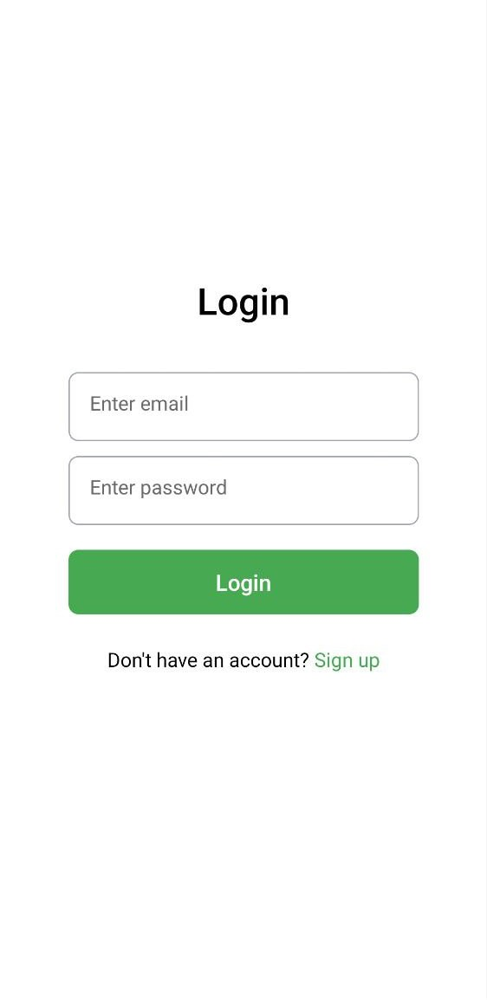
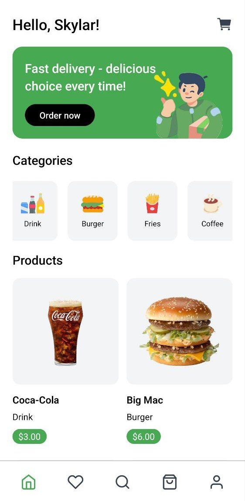
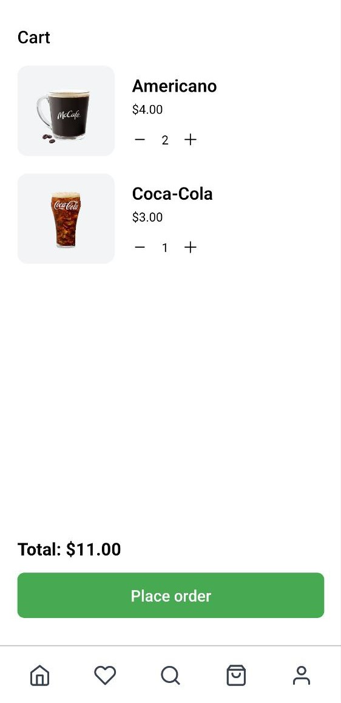
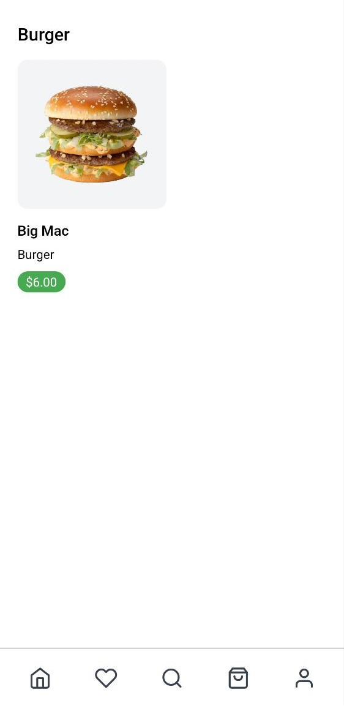
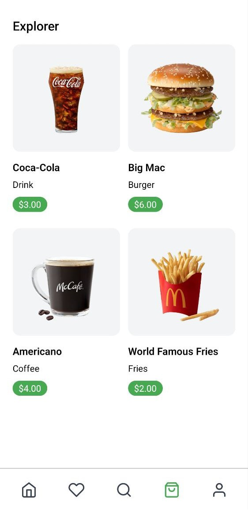
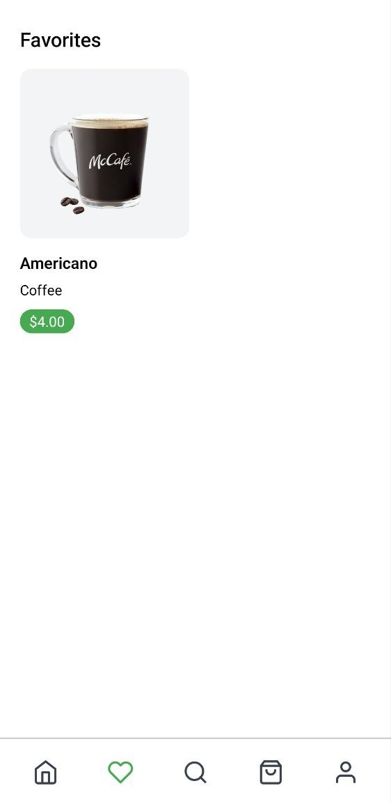
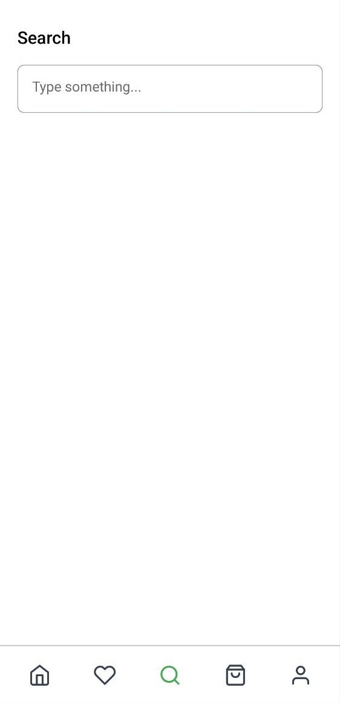

# Food delivery app react native
Полноценное приложение для доставки еды на React Native,

## Описание
🛠️ Стэк проекта: React Native, Nest.js, PostgreSQL, Prisma, React Hook Form, Redux Toolkit, TypeScript

- 🛠️ Full-stack реализация
- 💳 Реализация оплаты
- 🛒 Полноценная корзина и оформление заказа
- 🔑 Авторизация пользователей

## Скриншоты

### Вход / регестрация

### Домашняя страница

### Корзина

### Категория

### Товары

### Избранное

### Профиль

### Поиск
